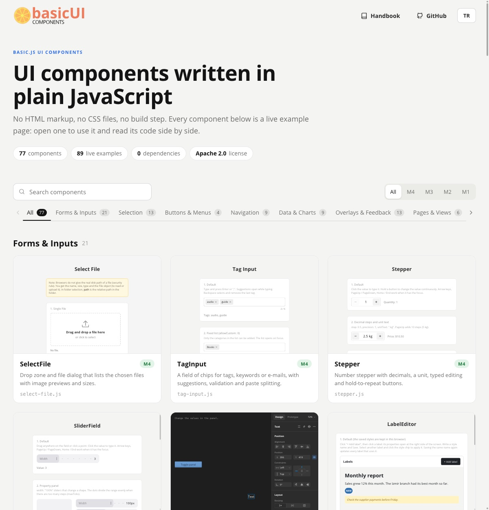

# JS-Component Suite

> **Design with code. Skip the complexity.**
> UI components, samples and app templates for building web interfaces in plain JavaScript. You don't write HTML markup or CSS files.

JS-Component Suite is built on [**basic.js**](https://bug7a.github.io/basic.js/), a small, dependency-free library that creates DOM objects directly from JavaScript. It has no virtual DOM, no build step and no `node_modules`. You add a `<script>` tag, write a few lines and open the page in a browser.

**[Browse the components](https://bug7a.github.io/js-components/)** · **[Handbook](https://bug7a.github.io/basic.js-handbook/)** · **[basic.js](https://bug7a.github.io/basic.js/)**

[](https://bug7a.github.io/js-components/)

---

## A Quick Look

```html
<link rel="stylesheet" href="basic/basic.min.css">
<script src="basic/basic.min.js"></script>
<script src="comp-m3/button-with-icon.js"></script>

<script>
const start = function () {

    VGroup({ align: "center", gap: 16 });

        Label({ text: "Hello!", fontSize: 24 });

        ButtonWithIcon({
            width: 200,
            height: 50,
            labelText: "Click Me",
            iconFile: "assets/icons/alert-black.png",
            onClick: function (self) { println("Clicked"); },
        });

    endGroup();
};
</script>
```

When the page loads, basic.js creates the global `page` and calls `start()`. Every object you create goes into the current container, and `VGroup` … `endGroup()` lays those objects out vertically with flexbox.

---

## What Is Inside

More than 70 components. Every one has a live example with its code in the [component catalog](https://bug7a.github.io/js-components/).

| Group | Some of the components |
| :--- | :--- |
| **Forms and inputs** | `InputB` and its email, password, phone, number, currency and URL versions, `TextareaB`, `TagInput`, `Stepper`, `SliderField`, `RichTextEditor`, `Form` |
| **Selection** | `SelectBox`, `SelectDate`, `SelectTime`, `SelectColor`, `SelectFile`, `CheckBox`, `RadioButton`, `Toggle` |
| **Buttons and menus** | `ButtonWithIcon`, `HoldToConfirmButton`, `ContextMenu` |
| **Navigation** | `Tabs`, `Breadcrumbs`, `LeftMenu`, `BottomBar`, `PageControl` |
| **Data and charts** | `SmartTable`, `ChartBox`, `Gauge`, `SparkLineBox`, `ProgressBar`, `TimeLine`, `SortableList` |
| **Overlays and feedback** | `Modal`, `Dialog`, `SidePanel`, `Toast`, `Tooltip`, `LoadingScreen` |
| **Pages and views** | `LoginPage`, `WebView`, `PropertyPanel`, `LabelEditor` |

---

## Why JS-Component Suite?

* **Readable code:** The code for a screen follows the layout of the screen, so you can understand it at a glance.
* **Small learning curve:** If you know JavaScript, a handful of concepts are enough to start: `Box`, `Label`, `Button`, `AutoLayout` and `that`.
* **One place for everything:** You define layout, style and behavior together in JavaScript, so you don't have to keep markup, stylesheets and logic in sync across files.
* **Lightweight:** There are no external dependencies or framework runtime. Components work directly on the DOM.
* **Fast prototyping:** It suits solo developers and small teams who want to go from idea to working interface quickly.

---

## Key Features

### Self-Contained Components
Each component carries its own logic and styling. You create one with a single call and a props object, and change it later through explicit `setX()` methods.

### AutoLayout
AutoLayout wraps CSS flexbox in designer-friendly props such as `flow: "vertical"`, `align: "center top"`, `gap` and `padding`.

### Simple Motion
To animate an object, declare its transitions once with `obj.setMotion("left 0.3s, opacity 0.2s")` and then change its properties.

### Style Packages
The newer components come with ready-made looks. Pick one with `styleName` (`Tabs({ styleName: "modern" })`; most have `classic`, `modern` and `dark`), and change single values with the `style` prop.

### Theming (optional)
`comp-m4/ui-standards.js` adds the global `UI`: color and size tokens (`UI.COLOR_SURFACE`, `UI.COLOR_PRIMARY`, `UI.ROUND_*`…) that keep the same name in every theme, and `UI.setTheme("light" | "dark" | "auto")` to switch. The components don't need it; use it for the colors of your own pages.

---

## Getting Started

1. Clone or download this repository.
2. Open any `.htm` file in a browser. Many pages load images or other local files, so a local server works best. The VS Code **Live Server** extension is preconfigured on port `5505`.
3. For a new page, start from `_empty-project-template.htm`. For a new component, start from `_component-template.js`.

Load scripts in this order: `basic.css` and `basic.js` first, then `ui-standards` if you use it, then the components, then your page code.

### Using the components in your own project

Create your project folder in the repository and load what you need with relative paths (`../basic/…`, `../comp-m4/…`). When it is ready to leave the repository, run:

```sh
./_make-standalone.sh my-project
```

It copies the library and component files your pages load into `my-project/basic/` and `my-project/comp/` and rewrites the paths, so the folder works on its own. Run it again to refresh the copies.

### `.min.js` twins

Most components have a `.min.js` twin next to them, and sample pages often load that version. After you edit a source file, rebuild its twin:

```sh
./_make-min-js.sh --build comp-m4/tabs.js
```

Both scripts use [terser](https://terser.org/) through `npx`, so they need Node.js. Nothing else in the repository does.

---

## Repository Structure

| Path | Contents |
| :--- | :--- |
| `basic/` | The core library (`basic.js`, `basic.css`, fonts) |
| `comp-m1/` … `comp-m4/` | Components, grouped by generation. `m1` is legacy and `m4` is the newest. |
| `index.htm`, `index/` | The component catalog site |
| `01-basic-samples-m1/` | Step-by-step tutorial pages for the core library |
| `02-comp-m*-samples/` | One demo page per component |
| `03-webpage-m2/` | Web sites drawn with basic.js: the library site and the handbook site |
| `04-template-m1/` | App templates: to-do app, data table |
| `04-template-m2/` | App templates: admin panel, web forms (contact, appointment, order…), and `easy-pwa`, a script that turns a site into an installable app |
| `05-showcase-m2/` | Links to live apps made with basic.js |
| `__handbook/` | The basic.js handbook in [English](__handbook/english/) and [Turkish](__handbook/turkce/) |
| `context/` | Short reference docs for the core library and components, written for AI assistants |
| `__developer-toolkit/` | VS Code extensions for basic.js: completer, object navigator, view inspector |
| `test/` | Self-checking test pages for basic.js and the components (open one, the tab title says ALL PASS) |
| `assets/` | Images shared by the samples |

---

## Comparison at a Glance

| | JS-Component Suite | Typical Frameworks |
| :--- | :--- | :--- |
| **Learning curve** | Plain JavaScript | Extra syntax (JSX, templates, DSLs) |
| **Styling** | Defined on the object | Separate CSS / Tailwind / Sass |
| **Build step** | None | Bundler and toolchain |
| **Dependencies** | None | Many `node_modules` packages |
| **Search engines** | The page is drawn by JavaScript; content for crawlers is added by hand | Server-side rendering available |
| **Ecosystem** | One library and this repository | Large community, many third-party packages |

It fits admin panels, dashboards, internal tools, forms and prototypes written by one developer or a small team. For a content site that lives on search traffic, or a large team that needs a framework's conventions, a typical framework is the better choice.

---

## Built with This Technology

* **UI Components:** [Browse Components](https://bug7a.github.io/js-components/)
* **Mobile App Template:** [JavaScript Mobile App Template](https://bug7a.github.io/javascript-mobile-app-template/)
* **Mobile App on Web:** [Expense Showcase App](https://bug7a.github.io/expense/)
* **PC Game on Steam:** [The Fallen Kingdoms](https://store.steampowered.com/app/2923920/)

---

## License

Copyright 2020-2026 Bugra Ozden <bugra.ozden@gmail.com>
Licensed under the [Apache License, Version 2.0](LICENSE).
